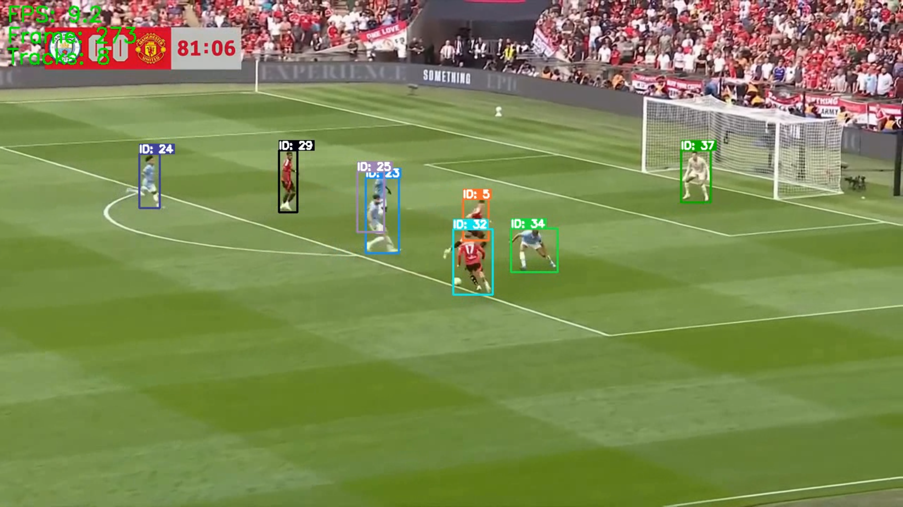

# IdentySync: Player Re-Identification in Sports Footage

**IdentySync** implements a robust system for player re-identification in sports videos. It ensures consistent tracking and labeling of players using YOLOv11 for detection, ByteTrack for tracking, and appearance-based re-identification for maintaining consistent player IDs—even when players exit and re-enter the frame.

> **Note**: This repository excludes large files (e.g., `.pt` models and `.mp4` videos). Please download them separately as instructed below.

---

## Demonstration

### Player Labeling

`Player Label.png`

The system overlays visible and consistent player ID labels on detected bounding boxes throughout the video. The image below illustrates player detection with ID annotations, updated every frame and consistent across disappearances:


### Re-Identification After Reappearance

`Reidentification.png`

This frame captures how the system successfully re-identifies players after temporary disappearance. The IDs remain consistent due to the re-identification module:



---

## Overview

The pipeline integrates detection, tracking, and re-identification:

* **Detection**: Ultralytics YOLOv11 (`best.pt`) is used to detect players frame by frame.
* **Tracking**: ByteTrack assigns unique IDs and maintains trajectories.
* **Re-Identification**: When a player reappears after occlusion or exiting the frame, their ID is preserved based on visual similarity.
* **Visualization**: Each bounding box is overlaid with a consistent, color-coded ID label.

---

## Features

* Accurate detection using YOLOv11 (`best.pt`)
* Multi-object tracking with ByteTrack
* Appearance-based re-identification using ResNet18 features
* Robust performance during occlusion and re-entry
* FPS counter, track count, and gallery size shown in overlay
* Modular, scalable, and readable codebase
* Customizable parameters for real-time tuning

---

## Requirements

* Python ≥ 3.6
* PyTorch
* OpenCV
* NumPy
* SciPy
* Git (for ByteTrack clone)

---

## Installation

1. **Clone the repository**

```bash
git clone https://github.com/PraTham-Patill/IdentySync.git
cd IdentySync
```

2. **Place large files**
   Download the following files separately and place them in the root directory:

* `best.pt` (YOLOv11 fine-tuned model)
* `15sec_input_720p.mp4` (Input video)

3. **Install dependencies**

```bash
python setup.py
```

This installs all required packages and sets up ByteTrack.

---

## Usage

Run the complete player re-identification system:

```bash
python player_reid.py
```

This processes the input video and generates `output_reid.mp4`.

To perform basic tracking only:

```bash
python player_tracking.py
```

---

## Project Structure

* `player_reid.py` – Advanced implementation with re-identification
* `player_tracking.py` – Basic tracker-only implementation
* `evaluate.py` – Metrics and evaluation utilities
* `requirements.txt` – Required Python packages
* `setup.py` – Dependency installer
* `report.md` – Technical report
* `README.md` – Project documentation
* `.gitignore` – Excludes `.pt`, `.mp4`, and other large or binary files

---

## Customization

Change default values in `player_reid.py`:

* `conf_thresh`: Detection confidence threshold
* `iou_thresh`: Intersection over union threshold
* `reid_threshold`: Re-ID matching threshold
* `max_disappeared_frames`: How long to keep player features in memory

---

## Acknowledgements

* YOLOv11 from Ultralytics (custom fine-tuned model `best.pt`)
* [ByteTrack](https://github.com/ifzhang/ByteTrack) for tracking module

---
